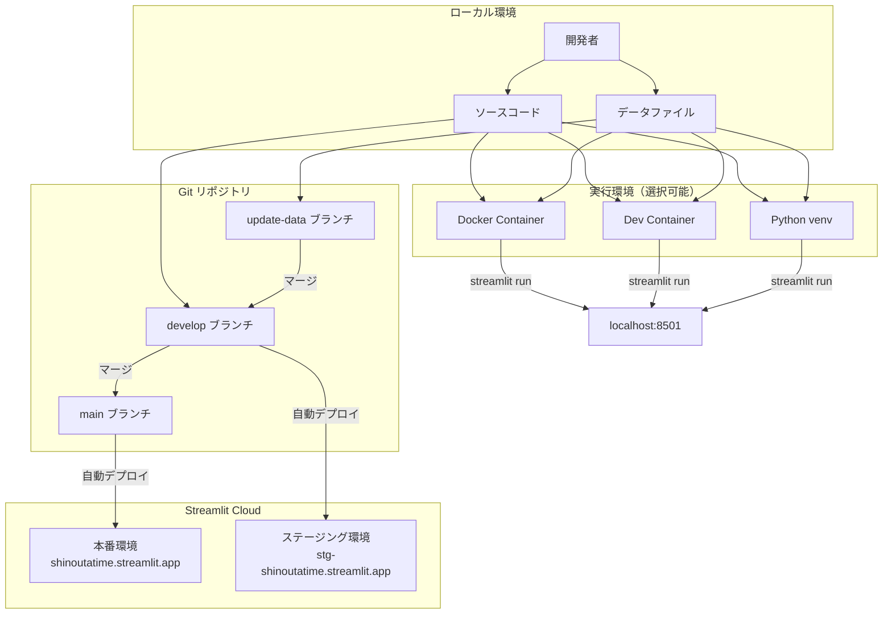
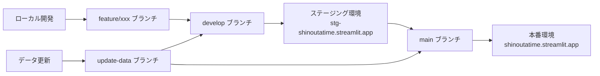

# 設計書：ローカル環境構築

## 概要

本ドキュメントは、「しのうたタイム」アプリケーションをローカル端末で動作させるための環境構築の設計を定義します。ローカル環境を汚さないことを最優先とし、Docker、Dev Container、Python仮想環境の3つの方法を提供します。

### 設計目標

1. **環境の分離**: ローカル環境のPython環境に影響を与えない
2. **本番環境との整合性**: Streamlit Cloud（Python 3.11）と同じ環境を再現
3. **開発効率**: Docker Composeで簡単に環境を構築・起動できる
4. **シンプルさ**: Docker Composeを主要な方法とし、セットアップを最小限にする

## アーキテクチャ

### 環境構築方法

**主要な方法: Docker Compose**

Docker Composeを使用した環境構築を標準とします。この方法により、以下のメリットが得られます：

- **完全な環境分離**: ローカルのPython環境に一切影響を与えない
- **簡単なセットアップ**: `docker-compose up`コマンド一つで起動
- **本番環境との一致**: Python 3.11を使用し、本番環境と同じ構成
- **クリーンアップが容易**: `docker-compose down`でコンテナを削除

**補助的な方法**

既存の`.devcontainer/devcontainer.json`も利用可能ですが、Docker Composeを推奨します。

### システム構成図



## コンポーネントと インターフェース

### 1. Docker環境

#### Dockerfile

Python 3.11ベースのイメージを使用し、必要な依存パッケージをインストールします。

**主要な設定:**
- ベースイメージ: `python:3.11-slim`
- 作業ディレクトリ: `/app`
- 依存パッケージ: `requirements.txt`からインストール
- ポート: 8501を公開

#### docker-compose.yml

Streamlitアプリケーションのサービス定義を行います。

**主要な設定:**
- サービス名: `shinouta-time`
- ボリュームマウント: `.:/app`（ローカルの変更を即座に反映）
- ポートマッピング: `8501:8501`
- 環境変数: `.env`ファイルから読み込み（オプション）
- コマンド: `streamlit run Home.py`

### 2. Dev Container環境

既存の`.devcontainer/devcontainer.json`を使用します。

**主要な設定:**
- ベースイメージ: `mcr.microsoft.com/devcontainers/python:1-3.11-bullseye`
- VS Code拡張機能: Python、Pylance
- 自動インストール: `requirements.txt`のパッケージ
- 自動起動: Streamlitサーバー
- ポート転送: 8501


## データモデル

### 環境設定ファイル

#### .env（オプション）

ローカル環境固有の設定を管理します。

```
SHINOUTA_LOG_LEVEL=DEBUG
SHINOUTA_ENABLE_FILE_LOGGING=true
SHINOUTA_LOG_FILE=logs/shinouta.log
```

#### requirements.txt

依存パッケージのバージョンを管理します。

```
streamlit
pandas
```

### ディレクトリ構造

```
.
├── .devcontainer/
│   └── devcontainer.json          # Dev Container設定
├── .env.example                    # 環境変数のサンプル
├── .env                            # 環境変数（ローカル用、.gitignore対象）
├── Dockerfile                      # Docker設定（新規作成）
├── docker-compose.yml              # Docker Compose設定（新規作成）
├── requirements.txt                # 依存パッケージ
├── Home.py                         # メインアプリケーション
└── data/                           # データファイル
    ├── M_YT_LIVE.TSV
    ├── M_YT_LIVE_TIMESTAMP.TSV
    └── V_SONG_LIST.TSV
```

## 正確性プロパティ

*プロパティは、システムの全ての有効な実行において真であるべき特性または動作です。プロパティは、人間が読める仕様と機械が検証可能な正確性保証の橋渡しとなります。*

### プロパティ1: 環境分離の保証

*任意の*Docker Composeの実行において、ローカル環境のグローバルPython環境に影響を与えないこと

**検証: 要件1.4、要件2.4**

### プロパティ2: 本番環境との一致

*任意の*Docker Composeの実行において、Python 3.11とrequirements.txtに記載された依存パッケージを使用すること

**検証: 要件13.1、要件13.2、要件14.1**

### プロパティ3: データファイルの整合性

*任意の*Docker Composeの実行において、data/ディレクトリ内の必須TSVファイル（M_YT_LIVE.TSV、M_YT_LIVE_TIMESTAMP.TSV、V_SONG_LIST.TSV）がボリュームマウントにより利用可能であること

**検証: 要件7.1、要件7.2、要件7.3、要件14.3**

### プロパティ4: ポートアクセスの一貫性

*任意の*Docker Composeの実行において、localhost:8501でアプリケーションにアクセスできること

**検証: 要件2.3、要件9.2、要件14.4**

### プロパティ5: ブランチと環境の対応

*任意の*ブランチにおいて、mainブランチは本番環境、developブランチはステージング環境に対応すること

**検証: 要件17.1、要件17.2**

## エラーハンドリング

### 1. Docker関連のエラー

**エラー**: Dockerがインストールされていない
- **検出方法**: `docker --version`コマンドの実行結果
- **対処方法**: Docker Desktopのインストール手順を提供

**エラー**: ポート8501が既に使用されている
- **検出方法**: `docker-compose up`実行時のエラーメッセージ
- **対処方法**: 使用中のプロセスを停止するか、docker-compose.ymlでポート番号を変更

### 2. Python環境関連のエラー

**エラー**: Pythonのバージョンが3.11ではない
- **検出方法**: `python --version`コマンドの実行結果
- **対処方法**: Python 3.11のインストール手順を提供

**エラー**: パッケージのインストールに失敗
- **検出方法**: `pip install -r requirements.txt`実行時のエラーメッセージ
- **対処方法**: ネットワーク接続の確認、pipのアップグレード、キャッシュのクリア

### 3. データファイル関連のエラー

**エラー**: 必須データファイルが見つからない
- **検出方法**: アプリケーション起動時のエラーメッセージ
- **対処方法**: data/ディレクトリの存在確認、Gitリポジトリの再クローン

### 4. Git関連のエラー

**エラー**: 誤ったブランチで作業している
- **検出方法**: `git branch`コマンドの実行結果
- **対処方法**: 適切なブランチへの切り替え手順を提供

## テスト戦略

### 環境構築の検証

環境構築が正しく完了したことを確認するための検証手順を提供します。

#### 1. 基本動作確認

**目的**: アプリケーションが正常に起動し、基本機能が動作することを確認

**手順**:
1. ブラウザで`http://localhost:8501`にアクセス
2. ホームページが表示されることを確認
3. 検索フォームが表示されることを確認
4. 任意のキーワードで検索を実行
5. 検索結果が表示されることを確認

#### 2. データ読み込み確認

**目的**: データファイルが正しく読み込まれることを確認

**手順**:
1. アプリケーションを起動
2. エラーメッセージが表示されないことを確認
3. 検索結果に配信日、曲名、アーティスト名が表示されることを確認

#### 3. 環境分離確認

**Docker Compose**:
- `docker-compose down`でコンテナを削除
- ローカル環境で`python --version`を実行し、Pythonがインストールされていないか、異なるバージョンであることを確認
- ローカル環境で`pip list`を実行し、streamlitがインストールされていないことを確認

#### 4. 本番環境との整合性確認

**目的**: ローカル環境と本番環境で同じ動作をすることを確認

**手順**:
1. ローカル環境で特定の検索を実行
2. 本番環境（shinoutatime.streamlit.app）で同じ検索を実行
3. 検索結果が一致することを確認

### ドキュメントテスト

**目的**: 環境構築手順が正確で、誰でも実行できることを確認

**方法**:
- 新しい開発者に環境構築手順を実行してもらう
- 手順の不明瞭な点や不足している情報をフィードバックしてもらう
- ドキュメントを改善する

## 実装の詳細

### Dockerfileの実装

```dockerfile
FROM python:3.11-slim

WORKDIR /app

# 依存パッケージのインストール
COPY requirements.txt .
RUN pip install --no-cache-dir -r requirements.txt

# アプリケーションファイルのコピー
COPY . .

# Streamlitのポートを公開
EXPOSE 8501

# Streamlitサーバーの起動
CMD ["streamlit", "run", "Home.py", "--server.address", "0.0.0.0"]
```

### docker-compose.ymlの実装

```yaml
version: '3.8'

services:
  shinouta-time:
    build: .
    ports:
      - "8501:8501"
    volumes:
      - .:/app
    environment:
      - SHINOUTA_LOG_LEVEL=${SHINOUTA_LOG_LEVEL:-INFO}
      - SHINOUTA_ENABLE_FILE_LOGGING=${SHINOUTA_ENABLE_FILE_LOGGING:-false}
      - SHINOUTA_LOG_FILE=${SHINOUTA_LOG_FILE:-logs/shinouta.log}
    command: streamlit run Home.py --server.address 0.0.0.0
```

### .gitignoreの更新

ローカル環境固有のファイルを本番環境に影響させないため、以下を追加します：

```
# ローカル環境
.env

# ログファイル
logs/
*.log
```

### 環境構築手順ドキュメント

Docker Composeを使用した環境構築の詳細な手順を記載したドキュメントを作成します。

#### Docker Compose環境構築手順（SETUP.md）

1. **前提条件の確認**
   - Docker Desktopのインストール確認
   - Gitのインストール確認

2. **リポジトリの取得**
   - Gitリポジトリのクローン
   - 適切なブランチへの切り替え

3. **環境変数の設定（オプション）**
   - `.env.example`を`.env`にコピー
   - 必要に応じて環境変数を編集

4. **アプリケーションの起動**
   - `docker-compose up`コマンドの実行
   - ログの確認

5. **動作確認**
   - ブラウザで`http://localhost:8501`にアクセス
   - 基本機能の動作確認

6. **停止とクリーンアップ**
   - `Ctrl+C`でサーバーを停止
   - `docker-compose down`でコンテナを削除

### トラブルシューティングガイド

よくある問題と解決方法をまとめたドキュメントを作成します。

**TROUBLESHOOTING.md**:
- Dockerが起動しない
- ポートが使用中
- パッケージのインストールに失敗
- データファイルが見つからない
- 文字エンコーディングエラー
- Pythonのバージョンが異なる

## 開発ワークフロー

### ブランチ戦略



### 開発フロー

1. **ローカル開発**
   - developブランチから作業ブランチを作成
   - ローカル環境で開発・動作確認
   - コミット・プッシュ

2. **ステージング確認**
   - developブランチにマージ
   - ステージング環境で動作確認
   - 問題があれば修正

3. **本番デプロイ**
   - mainブランチにマージ
   - 本番環境に自動デプロイ
   - 本番環境で最終確認

### データ更新フロー

1. **データファイルの更新**
   - update-dataブランチで作業
   - data/ディレクトリ内のTSVファイルを更新
   - コミット・プッシュ

2. **確認とマージ**
   - developブランチにマージしてステージング確認
   - または直接mainブランチにマージして本番反映

## パフォーマンス考慮事項

### Docker環境

- **ボリュームマウント**: ローカルの変更を即座に反映するため、ボリュームマウントを使用
- **イメージサイズ**: `python:3.11-slim`を使用して、イメージサイズを最小化
- **キャッシュ**: `--no-cache-dir`オプションでpipキャッシュを削除し、イメージサイズを削減

### Python仮想環境

- **パッケージインストール**: 必要最小限のパッケージのみをインストール
- **仮想環境の配置**: プロジェクトルートに配置し、.gitignoreで除外

## セキュリティ考慮事項

### 環境変数の管理

- `.env`ファイルは.gitignoreに追加し、Gitリポジトリにコミットしない
- `.env.example`ファイルでサンプルを提供
- 本番環境の環境変数はStreamlit Cloudの設定画面で管理

### 依存パッケージの管理

- requirements.txtで依存パッケージのバージョンを固定
- 定期的にセキュリティアップデートを確認
- 不要なパッケージは削除

## 今後の拡張性

### CI/CDパイプライン

将来的に、GitHub Actionsを使用したCI/CDパイプラインを構築することを検討します。

- **自動テスト**: プルリクエスト時に自動テストを実行
- **自動デプロイ**: mainブランチへのマージ時に自動デプロイ
- **コード品質チェック**: lintやフォーマットチェックを自動実行

### 複数環境のサポート

将来的に、開発環境、ステージング環境、本番環境の設定を分離することを検討します。

- **環境別設定ファイル**: `.env.development`、`.env.staging`、`.env.production`
- **環境変数の自動切り替え**: 環境に応じて適切な設定を読み込む
