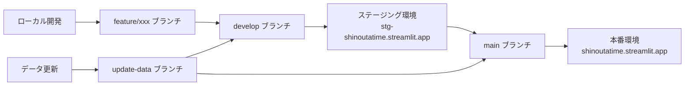
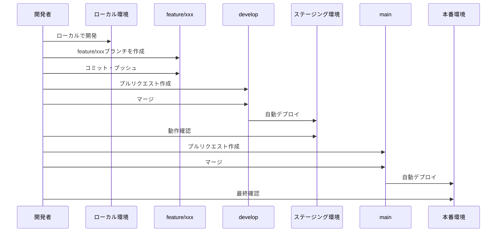
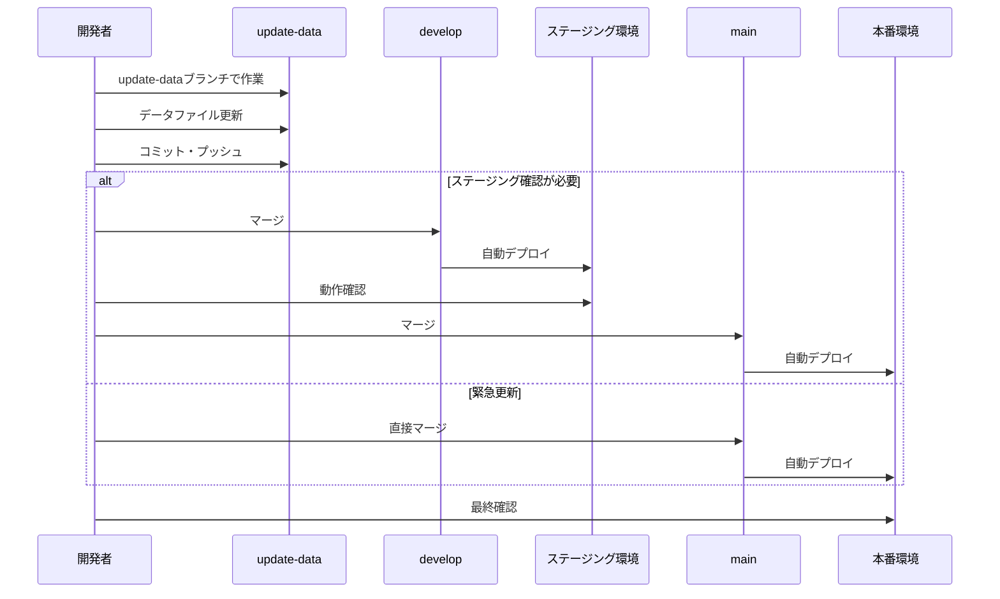
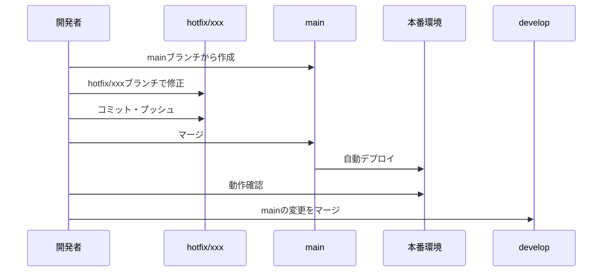

# ブランチ戦略

## 概要

本ドキュメントは、「しのうたタイム」プロジェクトにおけるGitブランチ戦略と、各ブランチとStreamlit Cloud環境の対応関係を説明します。

## ブランチと環境の対応関係



### 主要ブランチ

| ブランチ名 | 対応環境 | 用途 | 自動デプロイ |
|-----------|---------|------|------------|
| `main` | 本番環境<br/>(shinoutatime.streamlit.app) | 本番公開用の安定版コード | ✅ 有効 |
| `develop` | ステージング環境<br/>(stg-shinoutatime.streamlit.app) | 開発中の機能の統合とテスト | ✅ 有効 |
| `update-data` | なし | データファイル更新専用 | ❌ 無効 |

### 作業ブランチ

| ブランチ名パターン | 用途 | 作成元 | マージ先 |
|------------------|------|--------|---------|
| `feature/xxx` | 新機能開発 | `develop` | `develop` |
| `fix/xxx` | バグ修正 | `develop` | `develop` |
| `hotfix/xxx` | 緊急修正 | `main` | `main` → `develop` |

## ブランチの使い分け

### 1. main ブランチ

**目的**: 本番環境で公開される安定版コードを管理

**特徴**:
- 常に本番環境（shinoutatime.streamlit.app）と同期
- プッシュされると自動的にStreamlit Cloudが本番環境を更新
- 直接コミットは禁止（developブランチからのマージのみ）

**使用タイミング**:
- ステージング環境でのテストが完了し、本番リリースする準備ができたとき
- developブランチからプルリクエストを作成してマージ

**注意事項**:
- mainブランチへのマージは慎重に行う
- マージ後は必ず本番環境で動作確認を実施

### 2. develop ブランチ

**目的**: 開発中の機能を統合し、ステージング環境でテスト

**特徴**:
- 常にステージング環境（stg-shinoutatime.streamlit.app）と同期
- プッシュされると自動的にStreamlit Cloudがステージング環境を更新
- 新機能開発の基点となるブランチ

**使用タイミング**:
- 新機能の開発を開始するとき（feature/xxxブランチを作成）
- 作業ブランチでの開発が完了したとき（developにマージ）
- ステージング環境でテストを実施するとき

**注意事項**:
- developブランチは常に動作可能な状態を維持
- 不完全な機能はマージしない

### 3. update-data ブランチ

**目的**: データファイル（TSVファイル）の更新専用

**特徴**:
- Streamlit Cloud環境には直接デプロイされない
- データファイル（data/ディレクトリ内のTSVファイル）のみを更新
- コードの変更は含めない

**使用タイミング**:
- 配信情報や楽曲リストを更新するとき
- データファイルのみを更新し、コードは変更しないとき

**マージ先の選択**:
- **ステージング確認が必要な場合**: `update-data` → `develop` → `main`
- **緊急のデータ更新の場合**: `update-data` → `main`（直接マージ）

**注意事項**:
- データファイルのフォーマット（TSV形式）を維持
- 文字エンコーディング（UTF-8）を確認
- データの整合性を確認してからマージ

## 開発ワークフロー

### 新機能開発のフロー



#### ステップ1: ローカル開発

1. developブランチから作業ブランチを作成
   ```bash
   git checkout develop
   git pull origin develop
   git checkout -b feature/new-feature
   ```

2. ローカル環境で開発・動作確認
   - Docker Composeまたは仮想環境を使用
   - `http://localhost:8501`で動作確認

3. コミット・プッシュ
   ```bash
   git add .
   git commit -m "feat: 新機能の説明"
   git push origin feature/new-feature
   ```

#### ステップ2: ステージング確認

1. developブランチにマージ
   - GitHubでプルリクエストを作成
   - コードレビュー実施
   - developブランチにマージ

2. ステージング環境で動作確認
   - Streamlit Cloudが自動的にデプロイ
   - `https://stg-shinoutatime.streamlit.app`で確認
   - 問題があれば修正してdevelopに再度プッシュ

#### ステップ3: 本番デプロイ

1. mainブランチにマージ
   - GitHubでプルリクエストを作成
   - 最終レビュー実施
   - mainブランチにマージ

2. 本番環境で最終確認
   - Streamlit Cloudが自動的にデプロイ
   - `https://shinoutatime.streamlit.app`で確認
   - 問題があれば緊急修正（hotfix）を実施

### データ更新のフロー



#### ステップ1: データファイルの更新

1. update-dataブランチで作業
   ```bash
   git checkout update-data
   git pull origin update-data
   ```

2. データファイルを更新
   - `data/M_YT_LIVE.TSV`: 配信情報
   - `data/M_YT_LIVE_TIMESTAMP.TSV`: タイムスタンプ情報
   - `data/V_SONG_LIST.TSV`: 楽曲リスト

3. コミット・プッシュ
   ```bash
   git add data/
   git commit -m "data: 配信情報を更新"
   git push origin update-data
   ```

#### ステップ2: 確認とマージ

**パターンA: ステージング確認が必要な場合**

1. developブランチにマージ
   ```bash
   git checkout develop
   git merge update-data
   git push origin develop
   ```

2. ステージング環境で確認
   - `https://stg-shinoutatime.streamlit.app`で動作確認

3. mainブランチにマージ
   ```bash
   git checkout main
   git merge develop
   git push origin main
   ```

**パターンB: 緊急のデータ更新の場合**

1. mainブランチに直接マージ
   ```bash
   git checkout main
   git merge update-data
   git push origin main
   ```

2. developブランチにも反映
   ```bash
   git checkout develop
   git merge main
   git push origin develop
   ```

### 緊急修正（Hotfix）のフロー

本番環境で緊急の修正が必要な場合のフローです。



#### ステップ

1. mainブランチからhotfixブランチを作成
   ```bash
   git checkout main
   git pull origin main
   git checkout -b hotfix/critical-bug
   ```

2. 修正・コミット・プッシュ
   ```bash
   git add .
   git commit -m "hotfix: 緊急バグ修正"
   git push origin hotfix/critical-bug
   ```

3. mainブランチにマージ
   - GitHubでプルリクエストを作成
   - 緊急レビュー実施
   - mainブランチにマージ

4. 本番環境で確認
   - `https://shinoutatime.streamlit.app`で確認

5. developブランチにも反映
   ```bash
   git checkout develop
   git merge main
   git push origin develop
   ```

## ベストプラクティス

### コミットメッセージ

コミットメッセージは以下の形式を推奨します：

```
<type>: <subject>

<body>
```

**Type（種類）**:
- `feat`: 新機能
- `fix`: バグ修正
- `data`: データファイルの更新
- `docs`: ドキュメントのみの変更
- `style`: コードの意味に影響しない変更（空白、フォーマットなど）
- `refactor`: リファクタリング
- `test`: テストの追加・修正
- `chore`: ビルドプロセスやツールの変更

**例**:
```
feat: 検索機能に日付範囲フィルタを追加

ユーザーが配信日の範囲を指定して検索できるようにしました。
```

### プルリクエスト

プルリクエストを作成する際は、以下を含めることを推奨します：

1. **変更内容の説明**: 何を変更したか、なぜ変更したか
2. **テスト方法**: どのように動作確認したか
3. **スクリーンショット**: UI変更がある場合
4. **関連Issue**: 関連するIssueがあれば参照

### ブランチの命名規則

- **feature/**: 新機能開発（例: `feature/search-filter`）
- **fix/**: バグ修正（例: `fix/search-encoding`）
- **hotfix/**: 緊急修正（例: `hotfix/critical-bug`）
- **data/**: データ更新（update-dataブランチを使用）

### マージ前のチェックリスト

developまたはmainブランチにマージする前に、以下を確認してください：

- [ ] ローカル環境で動作確認済み
- [ ] コードレビュー完了
- [ ] コミットメッセージが適切
- [ ] 不要なファイルが含まれていない（.env、logs/など）
- [ ] requirements.txtが最新
- [ ] ドキュメントが更新されている（必要な場合）

## トラブルシューティング

### ブランチが最新でない

**問題**: ローカルブランチが古く、マージコンフリクトが発生する

**解決方法**:
```bash
# 最新のdevelopブランチを取得
git checkout develop
git pull origin develop

# 作業ブランチに最新の変更を取り込む
git checkout feature/your-feature
git merge develop

# コンフリクトを解決してコミット
git add .
git commit -m "merge: developブランチの最新変更を取り込み"
```

### 誤ったブランチで作業してしまった

**問題**: mainブランチで直接作業してしまった

**解決方法**:
```bash
# 変更を一時保存
git stash

# 正しいブランチを作成
git checkout develop
git checkout -b feature/correct-branch

# 変更を復元
git stash pop

# コミット・プッシュ
git add .
git commit -m "feat: 正しいブランチで作業"
git push origin feature/correct-branch
```

### update-dataブランチにコード変更が含まれてしまった

**問題**: データ更新のつもりがコードも変更してしまった

**解決方法**:
```bash
# コード変更を取り消す
git checkout HEAD -- <変更したコードファイル>

# データファイルのみをコミット
git add data/
git commit -m "data: データファイルのみを更新"
```

## まとめ

- **main**: 本番環境、安定版のみ
- **develop**: ステージング環境、開発中の機能を統合
- **update-data**: データ更新専用、コード変更は含めない
- **feature/xxx**: 新機能開発、developから作成してdevelopにマージ
- **hotfix/xxx**: 緊急修正、mainから作成してmainとdevelopにマージ

このブランチ戦略に従うことで、安全かつ効率的な開発フローを実現できます。
