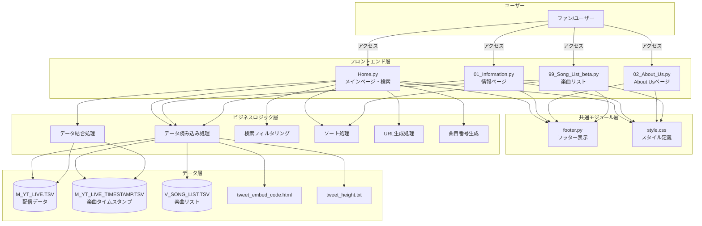
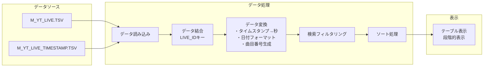
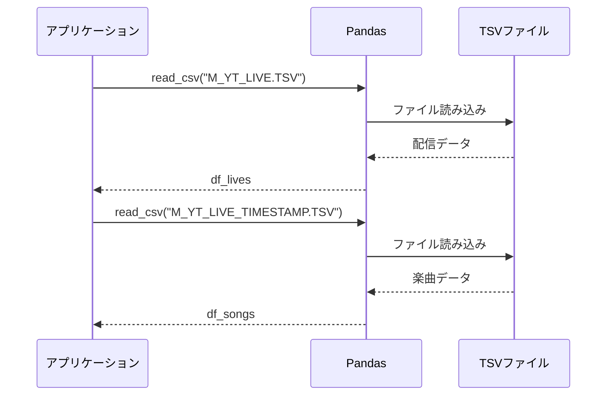
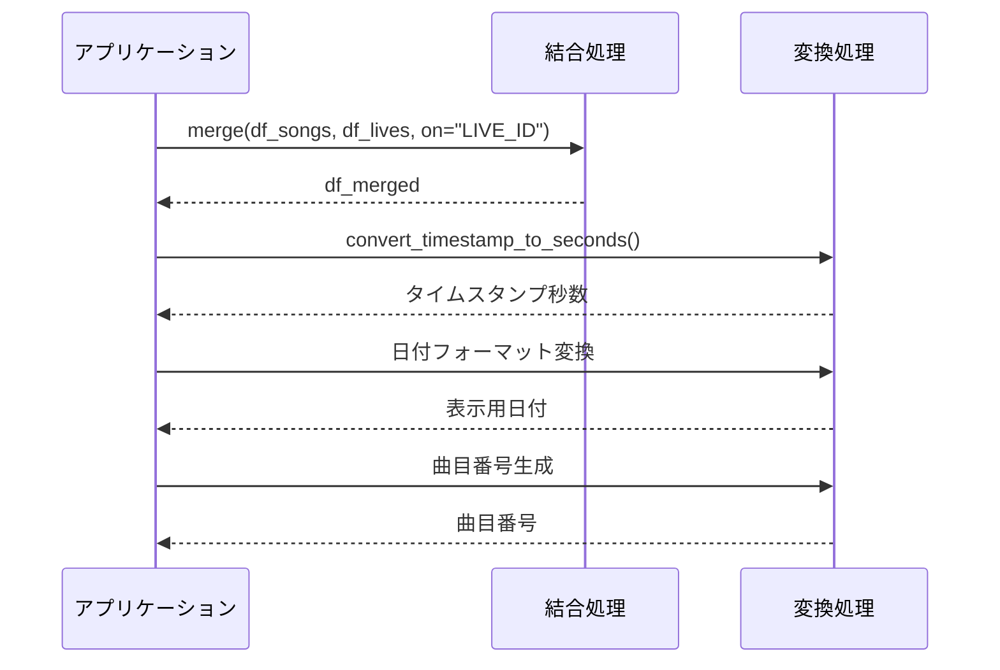
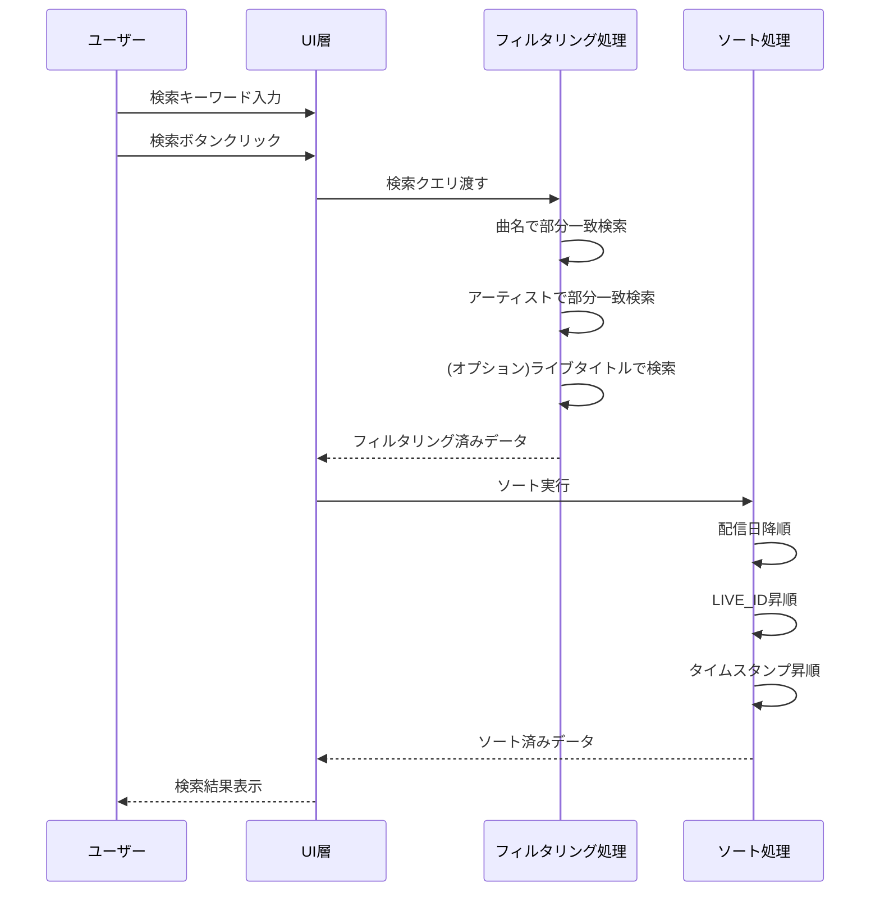

# アーキテクチャドキュメント

## 概要

「しのうたタイム」は、VTuber「幽音しの」さんの配信で歌唱された楽曲を検索・閲覧できる非公式ファンサイトです。本ドキュメントでは、アプリケーションのアーキテクチャ、システム構成、各コンポーネントの責務、および技術スタックについて説明します。

## システム構成図

### 全体アーキテクチャ



### データフロー図



## レイヤー構成

### 1. フロントエンド層（Streamlit UI）

ユーザーインターフェースを提供する層です。Streamlitフレームワークを使用して、Webページとして表示されます。

#### コンポーネント

##### Home.py（メインページ）
- **責務**: 
  - アプリケーションのエントリーポイント
  - 楽曲検索機能の提供
  - 検索結果の表示と段階的表示
  - ユーザー入力の受付
- **主要機能**:
  - キーワード検索（曲名、アーティスト、ライブタイトル）
  - 検索結果のテーブル表示
  - 段階的表示（25件ずつ）
  - YouTubeタイムスタンプ付きリンク生成

##### pages/01_Information.py（情報ページ）
- **責務**:
  - 配信スケジュールの表示
  - お知らせ情報の提供
  - 外部コンテンツの埋め込み
- **主要機能**:
  - YouTube動画埋め込み
  - Twitter投稿埋め込み
  - 過去のお知らせ表示（展開可能）

##### pages/02_About_Us.py（About Usページ）
- **責務**:
  - サイトの目的と背景の説明
  - 注意事項の表示
  - クレジット情報の提供
- **主要機能**:
  - 静的コンテンツの表示
  - 外部リンクの提供

##### pages/99_Song_List_beta.py（楽曲リストページ）
- **責務**:
  - 全楽曲リストの表示
  - アーティスト順のソート表示
  - β版の制約説明
- **主要機能**:
  - 楽曲リストデータの読み込み
  - アーティスト順ソート
  - 全件表示

### 2. 共通モジュール層

全ページで共通して使用されるモジュールを提供する層です。

#### コンポーネント

##### footer.py
- **責務**:
  - 全ページで統一されたフッター表示
  - クレジット情報の提供
- **インターフェース**:
  ```python
  def display_footer():
      """フッターを表示する関数"""
  ```

##### style.css
- **責務**:
  - アプリケーション全体のスタイリング
  - レイアウト調整
  - レスポンシブデザインの実装
- **主要スタイル**:
  - テーブルスタイル
  - レイアウト設定
  - 改行制御

### 3. ビジネスロジック層

データ処理とビジネスルールを実装する層です。

#### コンポーネント

##### データ読み込み処理
- **責務**: TSVファイルからデータを読み込む
- **実装**: Pandas `read_csv`関数を使用
- **エラーハンドリング**: ファイル不在時のエラー表示

##### データ結合処理
- **責務**: 配信データと楽曲データを結合
- **実装**: `LIVE_ID`をキーとした左結合（left join）
- **出力**: 結合済みDataFrame

##### 検索フィルタリング処理
- **責務**: ユーザーの検索クエリに基づいてデータをフィルタリング
- **実装**: 
  - 部分一致検索（大文字小文字を区別しない）
  - 複数フィールド対応（曲名、アーティスト、ライブタイトル）
- **出力**: フィルタリング済みDataFrame

##### ソート処理
- **責務**: データを適切な順序で並べ替え
- **実装**:
  - 配信日の降順
  - 同一日内はLIVE_IDの昇順
  - 同一配信内はタイムスタンプの昇順
- **出力**: ソート済みDataFrame

##### URL生成処理
- **責務**: YouTubeタイムスタンプ付きURLの生成
- **実装**:
  ```python
  def convert_timestamp_to_seconds(timestamp_str):
      """タイムスタンプ文字列を秒数に変換"""
  ```
- **出力**: タイムスタンプ付きURL文字列

##### 曲目番号生成処理
- **責務**: 配信内での歌唱順序を示す番号の生成
- **実装**:
  - 単一配信: 「曲順」形式
  - 複数配信: 「配信番号-曲順」形式
- **出力**: 曲目番号文字列

### 4. データ層

アプリケーションで使用するデータを格納する層です。

#### データファイル

##### M_YT_LIVE.TSV（配信データ）
- **内容**: YouTube配信の基本情報
- **フォーマット**: TSV（タブ区切り）
- **主要カラム**:
  - ID: 配信の一意識別子
  - 配信日: 配信日時
  - タイトル: 配信タイトル
  - URL: YouTube配信URL

##### M_YT_LIVE_TIMESTAMP.TSV（楽曲タイムスタンプデータ）
- **内容**: 配信内で歌唱された楽曲の情報
- **フォーマット**: TSV（タブ区切り）
- **主要カラム**:
  - ID: 楽曲レコードの一意識別子
  - LIVE_ID: 配信IDへの外部キー
  - 曲名: 楽曲名
  - アーティスト: アーティスト名
  - タイムスタンプ: 歌唱開始時刻

##### V_SONG_LIST.TSV（楽曲リストデータ）
- **内容**: 全楽曲のマスターリスト
- **フォーマット**: TSV（タブ区切り）
- **主要カラム**:
  - アーティスト: アーティスト名（表示用）
  - アーティスト(ソート用): ソート用アーティスト名
  - 曲名: 楽曲名
  - 最近の歌唱: 最近の歌唱へのURL

##### tweet_embed_code.html
- **内容**: Twitter投稿の埋め込みコード
- **フォーマット**: HTML

##### tweet_height.txt
- **内容**: Twitter埋め込みの表示高さ設定
- **フォーマット**: テキスト（数値）

## 技術スタック

### フレームワーク・ライブラリ

| 技術 | バージョン | 用途 |
|------|-----------|------|
| **Streamlit** | - | Webアプリケーションフレームワーク |
| **Python** | 3.x | プログラミング言語 |
| **Pandas** | - | データ処理・分析 |
| **Pillow (PIL)** | - | 画像処理 |

### データフォーマット

| フォーマット | 用途 |
|-------------|------|
| **TSV** | データストレージ（配信情報、楽曲情報） |
| **HTML** | Twitter埋め込みコード |
| **CSS** | スタイル定義 |

### 開発・実行環境

| 項目 | 内容 |
|------|------|
| **実行コマンド** | `streamlit run Home.py` |
| **依存関係管理** | `requirements.txt` |
| **インストール** | `pip install -r requirements.txt` |

## アーキテクチャの特徴

### 1. シンプルな構成

- ファイルベースのデータストレージ（TSV）
- データベース不要で軽量
- デプロイが容易

### 2. Streamlitの活用

- Pythonのみで完結するWeb開発
- リアクティブなUI更新
- セッション状態管理による状態保持

### 3. モジュール化

- 共通機能（フッター、CSS）の分離
- ページごとの独立した実装
- 再利用可能なコンポーネント

### 4. データキャッシング

```python
@st.cache_data
def load_data(path):
    """データ読み込みをキャッシュ"""
```

- Streamlitのキャッシュ機能を活用
- 不要な再読み込みを防止
- パフォーマンスの向上

### 5. 段階的表示

- 初期表示を25件に制限
- ユーザー操作で追加表示
- 大量データでも高速な初期表示

## セッション状態管理

Streamlitのセッション状態を使用して、ユーザーの操作状態を保持します。

### 主要なセッション変数

| 変数名 | 型 | 用途 |
|--------|---|------|
| `df_full` | DataFrame | 全データ |
| `filtered_df` | DataFrame | フィルタリング後のデータ |
| `search_query` | str | 検索クエリ |
| `include_live_title` | bool | ライブタイトル検索フラグ |
| `display_limit` | int | 表示件数制限 |

## データフロー詳細

### 1. 起動時のデータ読み込み



### 2. データ結合と変換



### 3. 検索処理



## エラーハンドリング戦略

### 1. ファイル読み込みエラー

```python
try:
    df = pd.read_csv(file_path, delimiter="\t")
except FileNotFoundError:
    st.error(f'エラー: ファイル "{file_path}" が見つかりません。')
except Exception as e:
    st.error(f'ファイル読み込み中にエラー: {e}')
```

### 2. データ変換エラー

```python
try:
    # データ変換処理
except Exception as e:
    st.warning(f"データ変換中にエラーが発生しました: {e}")
```

### 3. グレースフルデグラデーション

- エラー発生時もアプリケーションは継続動作
- ユーザーに適切なエラーメッセージを表示
- 部分的な機能不全でも他の機能は利用可能

## パフォーマンス最適化

### 1. データキャッシング

- `@st.cache_data`デコレータの使用
- ファイル変更時のみ再読み込み
- メモリ効率の向上

### 2. 段階的表示

- 初期表示: 25件
- 追加表示: 25件ずつ
- DOM要素数の削減

### 3. 効率的なデータ処理

- Pandasの最適化された操作を使用
- 不要な列の早期削除
- 一度だけのソート実行

## セキュリティ考慮事項

### 1. XSS対策

- HTMLリンク生成は信頼できるデータソースのみ
- ユーザー入力は検索クエリのみ
- `unsafe_allow_html=True`の使用を最小限に

### 2. データの完全性

- TSVファイルは信頼できるソースから提供
- 手動管理によるデータ品質の担保

### 3. 外部リンク

- YouTube URLは公式ドメインのみ
- Twitter埋め込みは公式コードを使用

## 拡張性

### 将来的な拡張の可能性

1. **データベース化**
   - SQLiteやPostgreSQLへの移行
   - より高度なクエリ機能

2. **検索機能の強化**
   - 正規表現検索
   - 複数キーワード検索（AND/OR）
   - 日付範囲検索

3. **ユーザー機能**
   - お気に入り機能
   - プレイリスト作成
   - 視聴履歴

4. **管理機能**
   - データ追加・編集のWebインターフェース
   - YouTube API連携
   - 自動データ取得

5. **分析機能**
   - 歌唱頻度の統計
   - アーティスト別集計
   - 時系列分析

## 制約事項

### 技術的制約

1. **Streamlitの制約**
   - サーバーサイドレンダリングのみ
   - クライアントサイドJavaScriptは限定的
   - リアルタイム更新には制限

2. **データストレージ**
   - ファイルベースのため、大規模データには不向き
   - 同時書き込みの制御が困難

3. **β版の制約**
   - 漢字のソート順が完全ではない
   - 一部楽曲の重複表示
   - 機能の予告なき変更の可能性

## まとめ

「しのうたタイム」は、Streamlitを活用したシンプルで効果的なアーキテクチャを採用しています。ファイルベースのデータストレージとモジュール化された設計により、メンテナンス性と拡張性を確保しつつ、ユーザーに快適な検索・閲覧体験を提供します。

今後の機能拡張やパフォーマンス改善の余地を残しながら、現時点では必要十分な機能を実装しています。
