# データフロードキュメント

## 概要

本ドキュメントは、「しのうたタイム」アプリケーションにおけるデータの流れを詳細に説明します。データの読み込みから表示まで、各処理ステップとデータモデルの関係を図示し、システムの動作を理解しやすくします。

## データフロー全体像

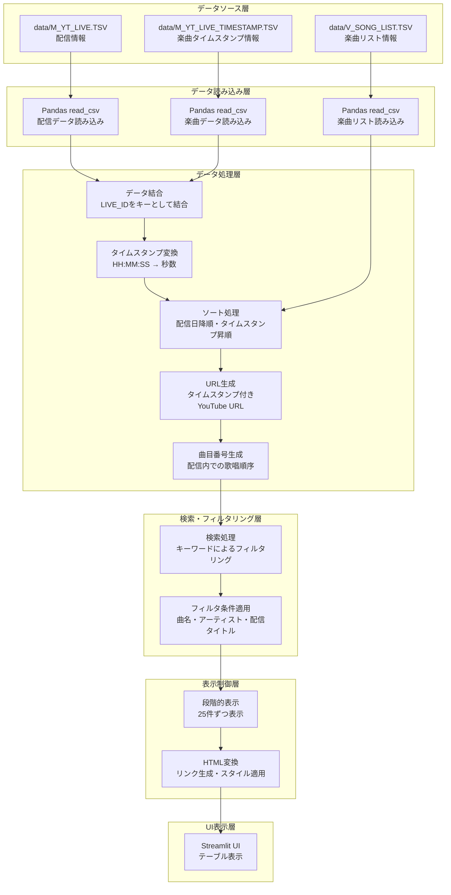

## メインページのデータフロー詳細

### 1. データ読み込みフェーズ

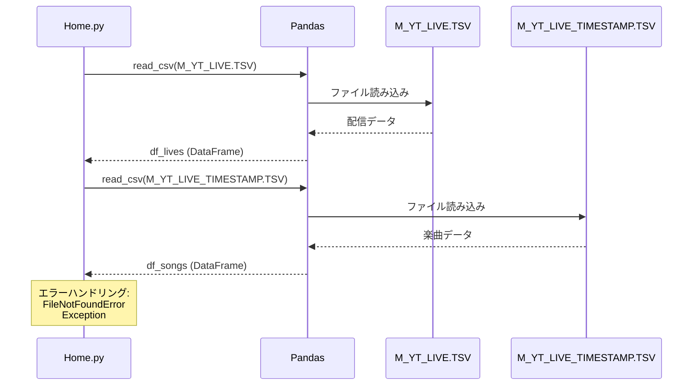

**処理内容:**
- `data/M_YT_LIVE.TSV`から配信情報を読み込む
- `data/M_YT_LIVE_TIMESTAMP.TSV`から楽曲タイムスタンプ情報を読み込む
- エラー発生時は適切なメッセージを表示し、処理を継続

**要件:** 1.1, 1.2, 1.3, 1.4

### 2. データ結合フェーズ

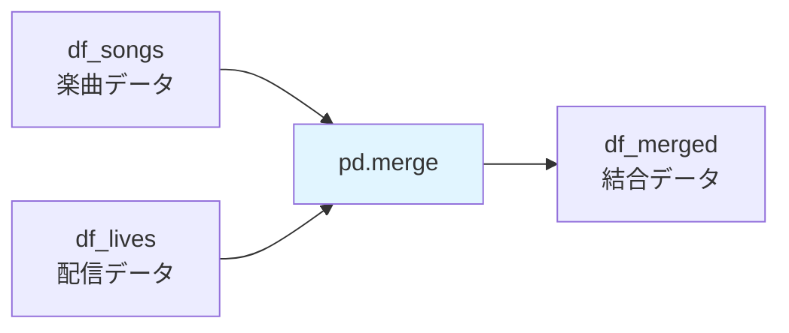


**処理内容:**
```python
df_merged = pd.merge(
    df_songs,
    df_lives[["ID", "配信日", "タイトル", "URL"]],
    left_on="LIVE_ID",
    right_on="ID",
    how="left",
    suffixes=("_song", "_live")
)
```

- 楽曲データの`LIVE_ID`と配信データの`ID`をキーとして左結合
- 各楽曲がどの配信で歌われたかを紐付ける
- 重複する列名には接尾辞（`_song`, `_live`）を付与

**要件:** 1.5

### 3. タイムスタンプ変換フェーズ

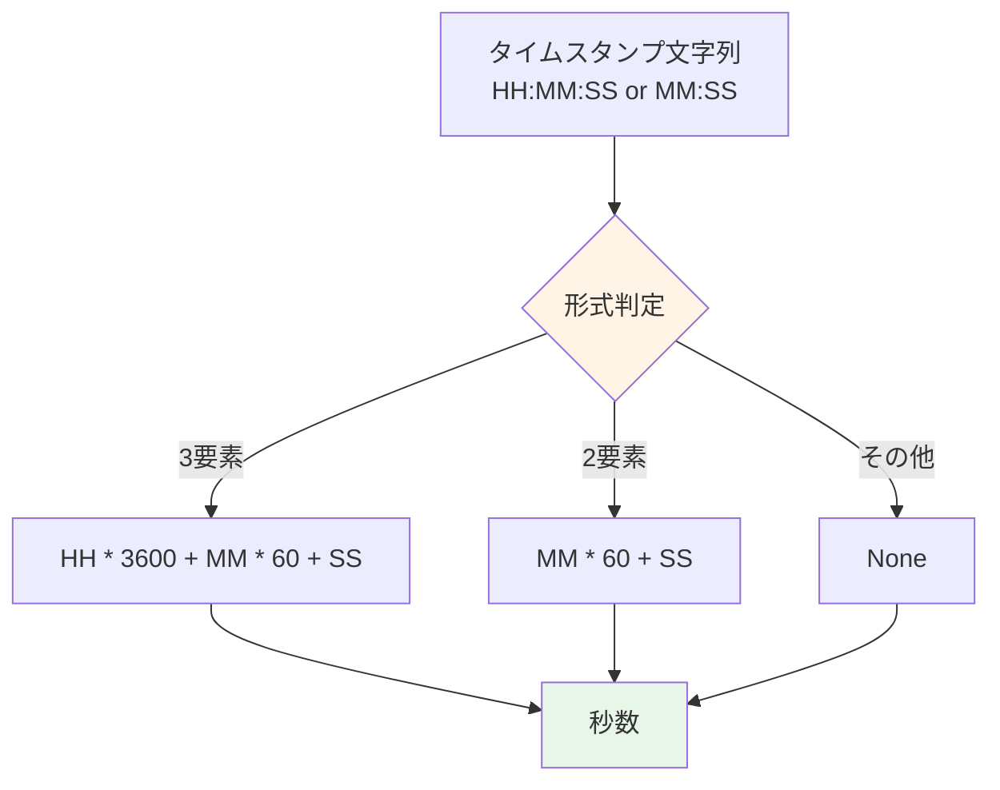

**処理内容:**
- `convert_timestamp_to_seconds()`関数を使用
- HH:MM:SS形式: 時間×3600 + 分×60 + 秒
- MM:SS形式: 分×60 + 秒
- 不正な形式の場合はNoneを返す

**要件:** 6.1


### 4. ソート処理フェーズ

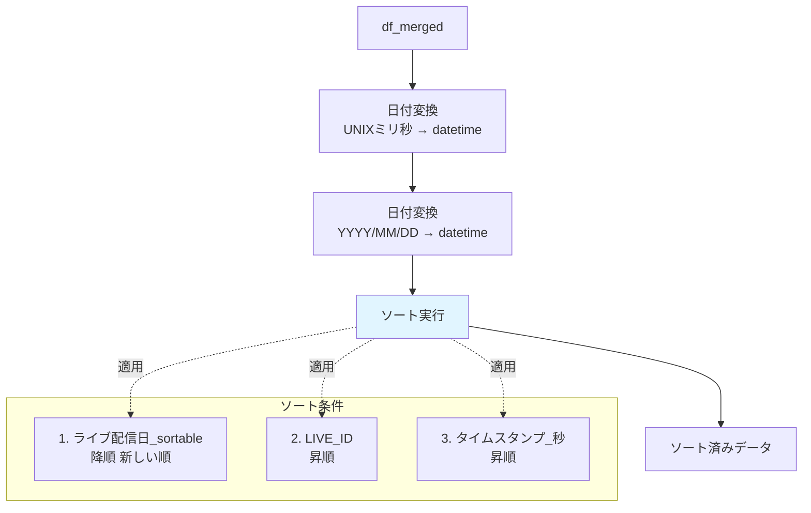

**処理内容:**
1. 配信日をdatetime型に変換（UNIXミリ秒 → datetime）
2. 変換失敗した行はYYYY/MM/DD形式として再変換
3. 3つのキーでソート:
   - 配信日降順（新しい配信が上）
   - LIVE_ID昇順（同一日の配信順）
   - タイムスタンプ昇順（配信内の歌唱順）

**要件:** 4.3, 4.4, 4.5

### 5. URL生成フェーズ


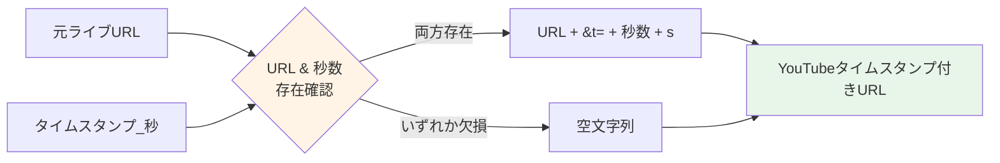

**処理内容:**
```python
df_merged["YouTubeタイムスタンプ付きURL"] = df_merged.apply(
    lambda row: (
        f"{row['元ライブURL']}&t={int(row['タイムスタンプ_秒'])}s"
        if pd.notna(row["元ライブURL"]) and pd.notna(row["タイムスタンプ_秒"])
        else ""
    ),
    axis=1
)
```

- 配信URLにタイムスタンプパラメータ（`&t=秒数s`）を付加
- URLまたは秒数が欠損している場合は空文字列

**要件:** 6.2, 6.3

### 6. 曲目番号生成フェーズ

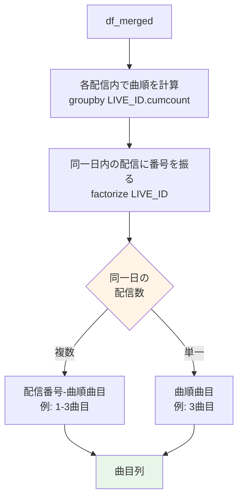


**処理内容:**
1. **曲順の計算**: `groupby("LIVE_ID").cumcount() + 1`で各配信内の連番を生成
2. **ライブ番号の計算**: 同一日内の配信に`factorize`で番号を振る
3. **曲目表示形式の決定**:
   - 同一日に複数配信: `{ライブ番号}-{曲順}曲目`
   - 同一日に単一配信: `{曲順}曲目`

**要件:** 7.1, 7.2, 7.3, 7.4

## 検索処理のデータフロー

### 検索フロー全体

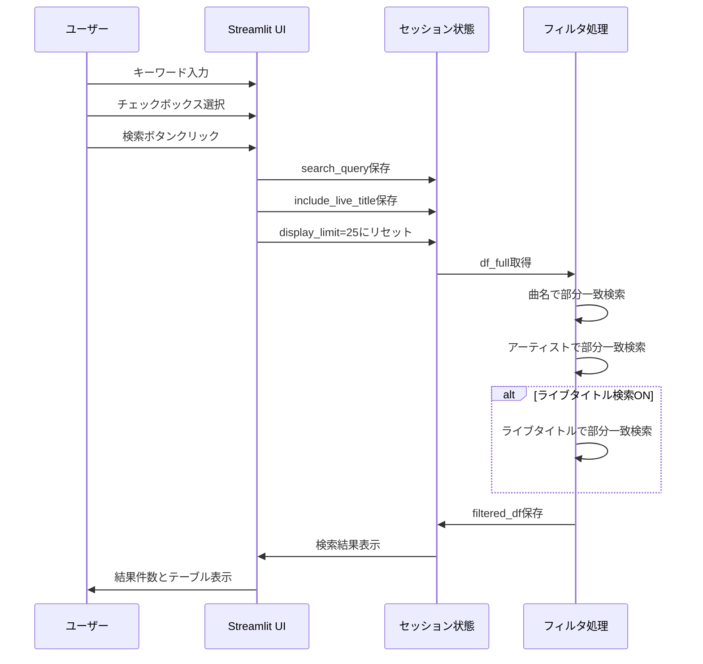


### 検索フィルタリング詳細

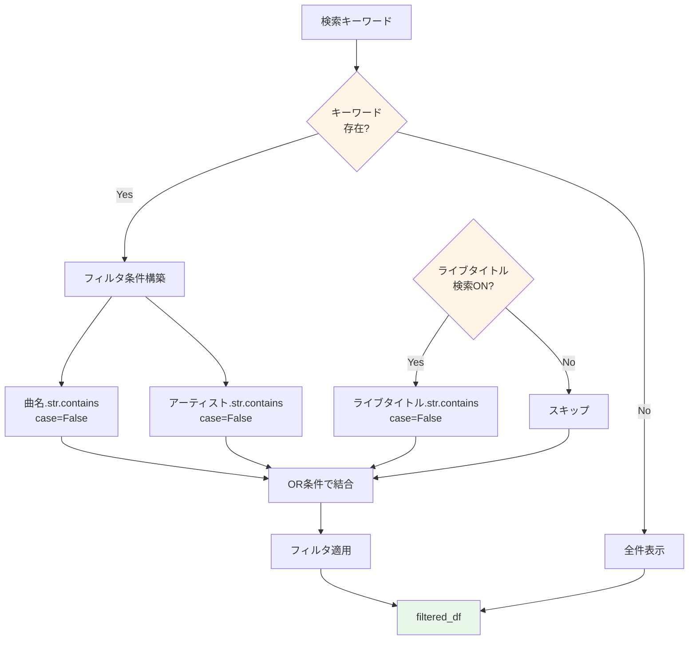

**処理内容:**
```python
filter_condition = (
    df_full["曲名"].astype(str).str.contains(search_query, case=False, na=False) |
    df_full["アーティスト"].astype(str).str.contains(search_query, case=False, na=False)
)

if include_live_title:
    filter_condition = filter_condition | df_full["ライブタイトル"].astype(str).str.contains(
        search_query, case=False, na=False
    )

filtered_df = df_full[filter_condition].copy()
```

**特徴:**
- 部分一致検索（`str.contains`）
- 大文字小文字を区別しない（`case=False`）
- 欠損値を無視（`na=False`）
- OR条件で複数フィールドを検索

**要件:** 2.3, 2.4, 2.5, 2.6, 2.8, 3.2, 3.3


### セッション状態管理

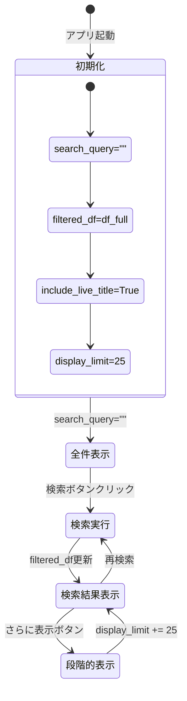

**セッション状態変数:**
- `df_full`: 全データ（フィルタリング前）
- `filtered_df`: フィルタリング後のデータ
- `search_query`: 検索キーワード
- `include_live_title`: ライブタイトル検索フラグ
- `display_limit`: 表示件数制限

**要件:** 2.1, 2.2, 2.7, 5.1, 5.2, 5.3

## 表示処理のデータフロー

### 段階的表示フロー

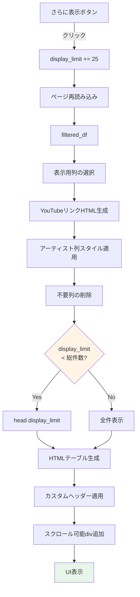


**処理内容:**
1. **列の選択**: 表示に必要な列のみを抽出
2. **HTMLリンク生成**: YouTubeタイムスタンプ付きURLをHTMLリンクに変換
3. **スタイル適用**: アーティスト列に`artist-cell`クラスを適用
4. **件数制限**: `head(display_limit)`で表示件数を制限
5. **HTML変換**: `to_html(escape=False)`でHTMLテーブルを生成
6. **カスタマイズ**: ヘッダーを短縮形に置き換え
7. **スクロール対応**: divタグで囲んで横スクロールを有効化

**要件:** 4.1, 4.2, 4.6, 5.1, 5.2, 5.3, 5.4, 6.4, 6.5

### HTML生成詳細

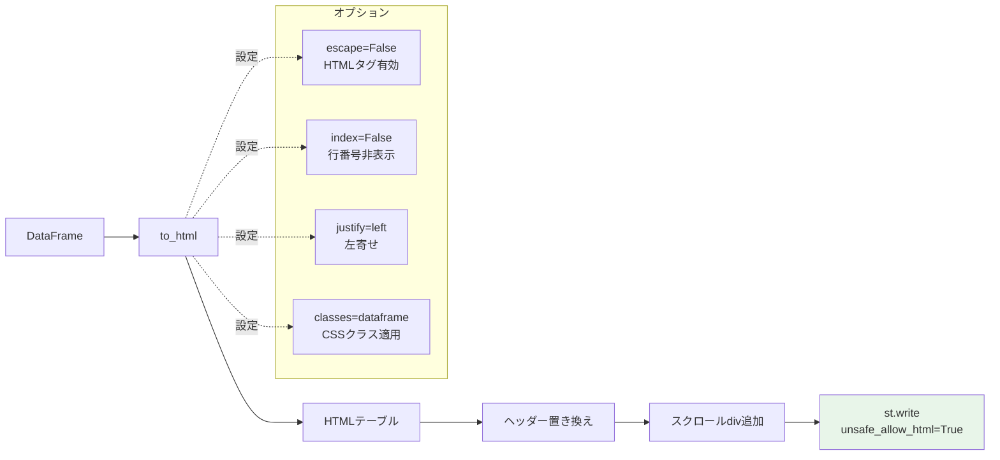

**生成されるHTML構造:**
```html
<div style="overflow-x: auto; max-width: 100%;">
    <table class="dataframe">
        <thead>
            <tr>
                <th>配信日</th>
                <th>No.</th>
                <th>曲名</th>
                <th>アーティスト</th>
                <th>リンク</th>
            </tr>
        </thead>
        <tbody>
            <tr>
                <td>2024/01/01</td>
                <td>1曲目</td>
                <td>曲名例</td>
                <td><div class="artist-cell">アーティスト名</div></td>
                <td><a href="..." target="_blank">YouTubeへ👻</a></td>
            </tr>
        </tbody>
    </table>
</div>
```

**要件:** 4.1, 4.2, 6.4, 6.5


## 楽曲リストページのデータフロー

### 楽曲リスト表示フロー

```mermaid
graph TB
    A[data/V_SONG_LIST.TSV] --> B[@st.cache_data<br/>load_data]
    B --> C[df_original]
    C --> D[ソート処理<br/>アーティスト ソート用]
    D --> E[df_sorted]
    E --> F[YouTubeリンク生成]
    F --> G[アーティスト列スタイル適用]
    G --> H[表示列選択]
    H --> I[HTMLテーブル生成]
    I --> J[UI表示]
    
    style B fill:#e1f5ff
    style J fill:#e8f5e9
```

**処理内容:**
1. **キャッシュ付き読み込み**: `@st.cache_data`デコレータで再読み込みを防ぐ
2. **ソート**: `アーティスト(ソート用)`列で大文字小文字を区別せずソート
3. **リンク生成**: 最近の歌唱URLをHTMLリンクに変換
4. **スタイル適用**: アーティスト列に改行許可のスタイルを適用
5. **表示**: 全件をHTMLテーブルで表示

**要件:** 8.1, 8.2, 8.3, 8.4, 8.5

### ソート処理詳細

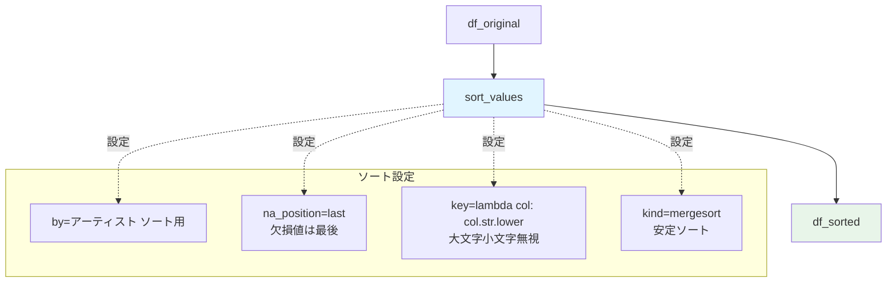

**ソート仕様:**
- `アーティスト(ソート用)`列を使用
- 大文字小文字を区別しない（`key=lambda col: col.str.lower()`）
- 欠損値は最後に配置（`na_position='last'`）
- 安定ソート（`kind='mergesort'`）で同一アーティスト内の曲順を維持

**β版の制約:**
- 漢字のソート順は完全ではない可能性があります

**要件:** 8.2, 8.3


## データモデルの関係

### エンティティ関係図（ER図）

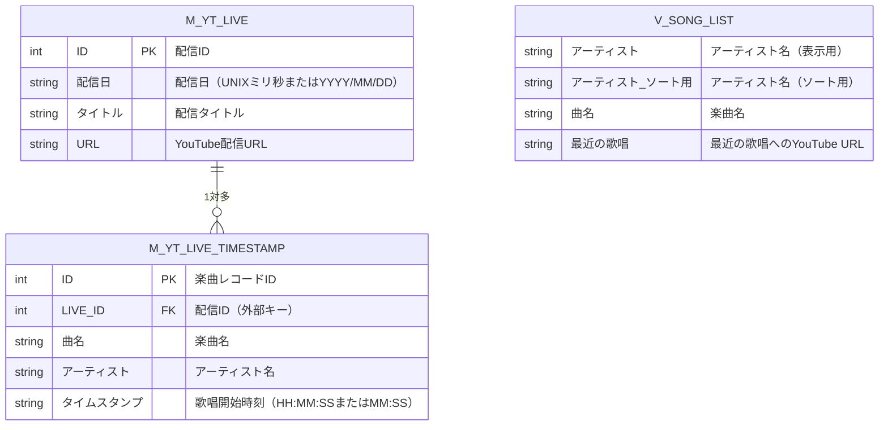

**関係性:**
- `M_YT_LIVE`（配信情報）と`M_YT_LIVE_TIMESTAMP`（楽曲情報）は1対多の関係
- 1つの配信に複数の楽曲が紐付く
- `LIVE_ID`が外部キーとして機能
- `V_SONG_LIST`は独立したビューで、他のテーブルとは直接の関係なし

**要件:** 1.1, 1.2, 1.5

### 結合後のデータモデル

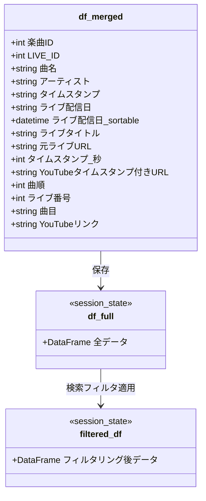


**派生カラム:**
- `楽曲ID`: 元の`ID_song`
- `ライブ配信日_sortable`: ソート用のdatetime型配信日
- `タイムスタンプ_秒`: タイムスタンプ文字列を秒数に変換
- `YouTubeタイムスタンプ付きURL`: 配信URL + タイムスタンプパラメータ
- `曲順`: 配信内での歌唱順序（1から始まる連番）
- `ライブ番号`: 同一日内の配信番号
- `曲目`: 表示用の曲目番号（例: "1-3曲目" または "3曲目"）
- `YouTubeリンク`: HTMLリンクタグ

## データ変換パイプライン

### 変換ステップの詳細

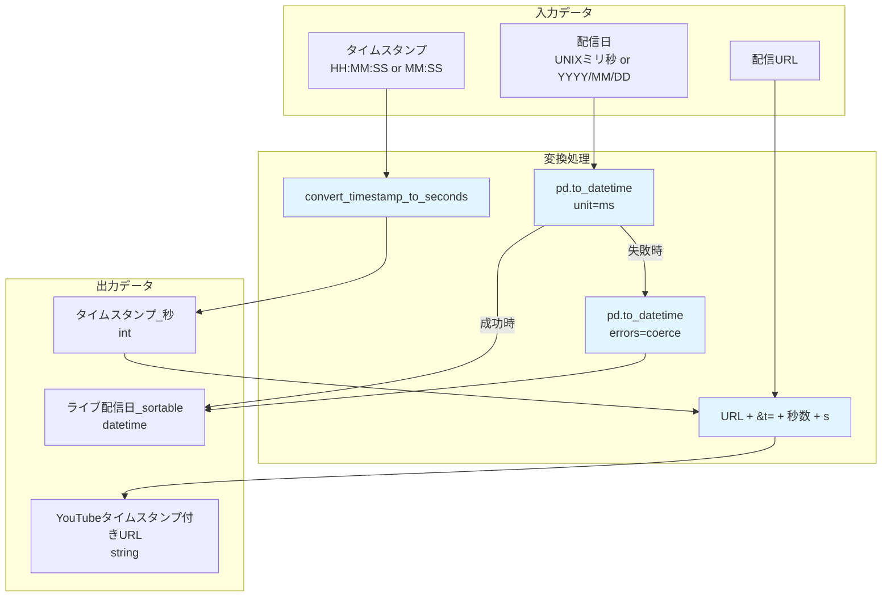

**変換ルール:**

1. **配信日変換:**
   - まずUNIXミリ秒として変換を試みる
   - 失敗した場合はYYYY/MM/DD形式として再変換
   - 両方失敗した場合はNaT（Not a Time）

2. **タイムスタンプ変換:**
   - コロン区切りで分割
   - 3要素（HH:MM:SS）: 時間×3600 + 分×60 + 秒
   - 2要素（MM:SS）: 分×60 + 秒
   - その他: None

3. **URL生成:**
   - 元URL + `&t=` + 秒数 + `s`
   - URLまたは秒数が欠損している場合は空文字列

**要件:** 1.5, 4.3, 6.1, 6.2, 6.3


## エラーハンドリングフロー

### ファイル読み込みエラー処理

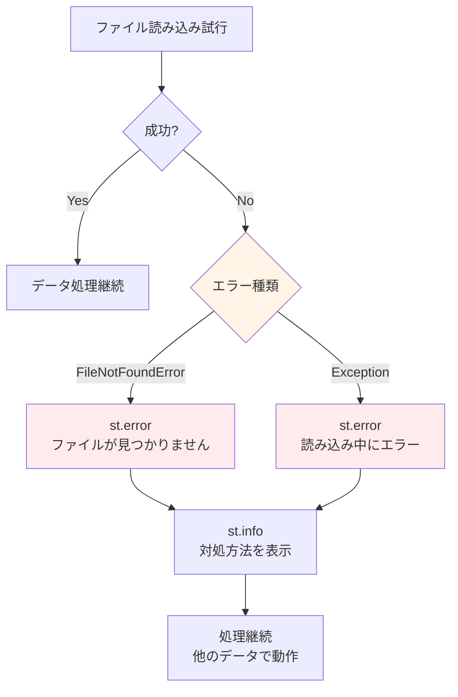

**エラーハンドリング戦略:**
- ファイルが見つからない場合: エラーメッセージと対処方法を表示
- その他のエラー: エラー内容を表示
- アプリケーションは停止せず、可能な範囲で動作を継続

**要件:** 1.3, 1.4, 13.1, 13.2, 13.4

### データ変換エラー処理

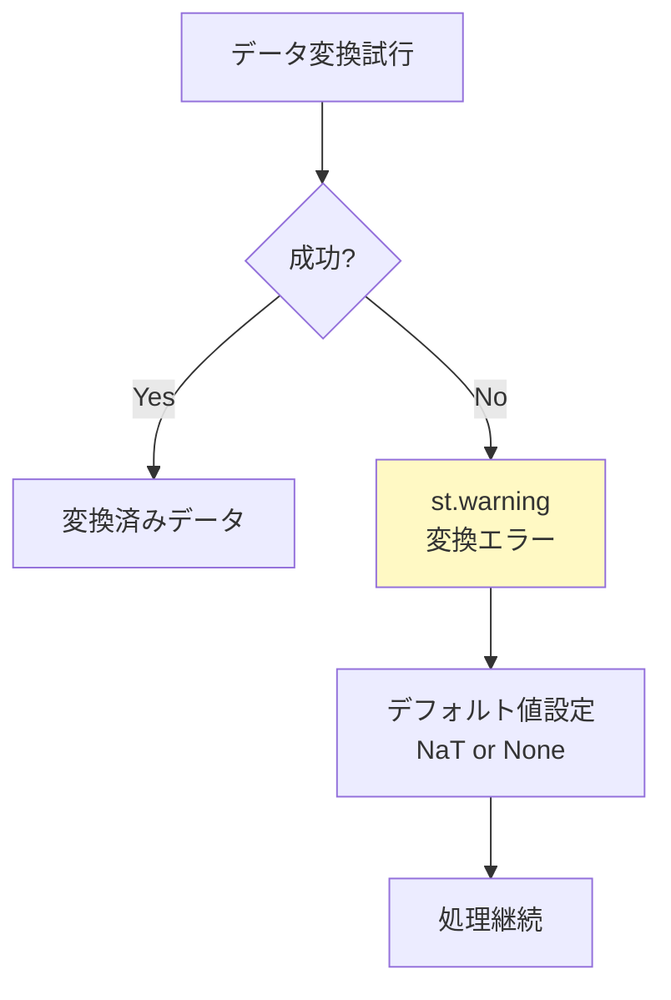

**変換エラー対応:**
- 日付変換失敗: NaT（Not a Time）を設定
- タイムスタンプ変換失敗: Noneを設定
- 警告メッセージを表示し、処理は継続

**要件:** 13.3, 13.4, 13.5

## パフォーマンス最適化

### キャッシュ戦略

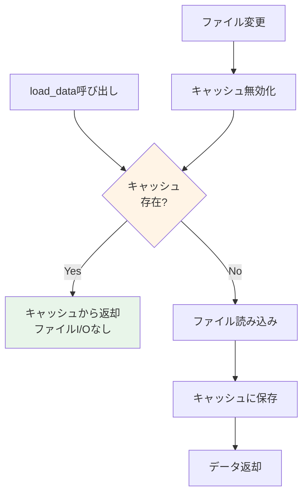

**キャッシュ効果:**
- 初回読み込み後、ファイルI/Oが不要
- ページ再読み込み時の高速化
- サーバーリソースの節約

**要件:** 8.1


### 段階的表示による最適化

```mermaid
graph LR
    A[検索結果<br/>1000件] --> B[初期表示<br/>25件]
    B --> C{ユーザー<br/>アクション}
    C -->|さらに表示| D[表示件数<br/>+25件]
    D --> E[50件表示]
    E --> C
    C -->|満足| F[終了]
    
    style B fill:#e8f5e9
    style F fill:#e8f5e9
```

**最適化効果:**
- 初期表示速度の向上
- メモリ使用量の削減
- ユーザー体験の向上（必要な分だけ表示）

**要件:** 4.6, 5.1, 5.2, 5.3, 5.4

## データフロー実行例

### 具体的な実行例

**入力データ:**

`M_YT_LIVE.TSV`:
```
ID	配信日	タイトル	URL
1	2024/01/01	新年歌枠	https://youtube.com/watch?v=abc123
2	2024/01/01	深夜歌枠	https://youtube.com/watch?v=def456
```

`M_YT_LIVE_TIMESTAMP.TSV`:
```
ID	LIVE_ID	曲名	アーティスト	タイムスタンプ
1	1	曲A	アーティストX	0:05:30
2	1	曲B	アーティストY	0:15:45
3	2	曲C	アーティストZ	0:10:20
```

**処理フロー:**

1. **データ読み込み:**
   - `df_lives`: 2行（配信2件）
   - `df_songs`: 3行（楽曲3件）

2. **データ結合:**
   - `LIVE_ID`をキーとして結合
   - 結果: 3行（各楽曲に配信情報が紐付く）

3. **タイムスタンプ変換:**
   - `0:05:30` → 330秒
   - `0:15:45` → 945秒
   - `0:10:20` → 620秒

4. **ソート:**
   - 配信日: 2024/01/01（同一）
   - LIVE_ID: 1, 1, 2の順
   - タイムスタンプ: 330, 945, 620の順

5. **曲目番号生成:**
   - 同一日に2配信あり
   - 配信1: 1-1曲目, 1-2曲目
   - 配信2: 2-1曲目

6. **URL生成:**
   - `https://youtube.com/watch?v=abc123&t=330s`
   - `https://youtube.com/watch?v=abc123&t=945s`
   - `https://youtube.com/watch?v=def456&t=620s`

**最終出力:**
```
配信日      | No.    | 曲名 | アーティスト | リンク
2024/01/01 | 1-1曲目 | 曲A  | アーティストX | YouTubeへ👻
2024/01/01 | 1-2曲目 | 曲B  | アーティストY | YouTubeへ👻
2024/01/01 | 2-1曲目 | 曲C  | アーティストZ | YouTubeへ👻
```

## まとめ

本ドキュメントでは、「しのうたタイム」アプリケーションのデータフローを詳細に説明しました。

**主要なデータフロー:**
1. **データ読み込み**: TSVファイルからPandas DataFrameへ
2. **データ結合**: 配信情報と楽曲情報の紐付け
3. **データ変換**: タイムスタンプ、日付、URLの変換
4. **ソート**: 配信日・LIVE_ID・タイムスタンプによる並び替え
5. **検索**: キーワードによるフィルタリング
6. **表示**: 段階的表示とHTML生成

**データモデルの関係:**
- `M_YT_LIVE`と`M_YT_LIVE_TIMESTAMP`は1対多の関係
- `LIVE_ID`が外部キーとして機能
- 結合後のデータに派生カラムを追加

**最適化手法:**
- キャッシュによる再読み込み防止
- 段階的表示による初期表示速度向上
- セッション状態による検索結果の保持

このデータフローに基づいて、アプリケーションは効率的かつ安定的に動作します。
