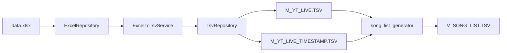

# 設計書

## 概要

本システムは、Excelファイル（data.xlsx）から2つのTSVファイル（M_YT_LIVE.TSVとM_YT_LIVE_TIMESTAMP.TSV）を自動生成し、さらに既存のsong_list_generatorツールを呼び出してV_SONG_LIST.TSVを生成する一連の処理を自動化します。

### 主な機能

1. **Excelファイルの読み込み**: openpyxlライブラリを使用してdata.xlsxを読み込む
2. **TSVファイルの生成**: 各シートをTSV形式で出力
3. **データ検証**: フィールド数、データ型、URL形式などを検証
4. **バックアップ機能**: 既存ファイルを上書きする前にバックアップを作成
5. **後続処理の実行**: song_list_generatorを自動実行してV_SONG_LIST.TSVを生成

## アーキテクチャ

### レイヤー構造

```
┌─────────────────────────────────────┐
│     CLI Layer (excel_to_tsv_cli)    │
│  - コマンドライン引数の解析          │
│  - ユーザーインターフェース          │
└──────────────┬──────────────────────┘
               │
┌──────────────▼──────────────────────┐
│  Service Layer (ExcelToTsvService)  │
│  - ビジネスロジック                  │
│  - データ変換処理                    │
│  - song_list_generatorの呼び出し    │
└──────────────┬──────────────────────┘
               │
┌──────────────▼──────────────────────┐
│ Repository Layer                     │
│  - ExcelRepository: Excel読み込み   │
│  - TsvRepository: TSV書き込み        │
│  - BackupRepository: バックアップ    │
└──────────────┬──────────────────────┘
               │
┌──────────────▼──────────────────────┐
│  Data Layer                          │
│  - data.xlsx (入力)                  │
│  - M_YT_LIVE.TSV (出力)              │
│  - M_YT_LIVE_TIMESTAMP.TSV (出力)    │
└──────────────────────────────────────┘
```

### データフロー



## コンポーネントとインターフェース

### 1. CLIモジュール (src/cli/excel_to_tsv_cli.py)

コマンドラインインターフェースを提供します。

**主要な関数:**
- `create_parser() -> ArgumentParser`: コマンドライン引数パーサーを作成
- `main() -> int`: メイン処理を実行

**コマンドライン引数:**
```
--input-file: 入力Excelファイルのパス (デフォルト: data/data.xlsx)
--output-dir: 出力ディレクトリのパス (デフォルト: data/)
--dry-run: ドライランモード（ファイルを書き込まない）
--skip-song-list: song_list_generatorの実行をスキップ
--verbose: 詳細ログを表示
--help: ヘルプメッセージを表示
```

### 2. サービスモジュール (src/services/excel_to_tsv_service.py)

Excel to TSV変換のビジネスロジックを実装します。

**クラス: ExcelToTsvService**

```python
class ExcelToTsvService:
    def __init__(
        self,
        excel_repo: ExcelRepository,
        tsv_repo: TsvRepository,
        backup_repo: BackupRepository
    ):
        """サービスを初期化"""
        
    def convert_excel_to_tsv(
        self,
        input_file: str,
        output_dir: str,
        dry_run: bool = False
    ) -> ConversionResult:
        """ExcelファイルをTSVファイルに変換"""
        
    def run_song_list_generator(
        self,
        live_file: str,
        timestamp_file: str,
        output_file: str
    ) -> bool:
        """song_list_generatorを実行"""
        
    def validate_sheet_data(
        self,
        sheet_name: str,
        rows: List[List[Any]]
    ) -> List[ValidationWarning]:
        """シートデータを検証"""
```

### 3. リポジトリモジュール

#### ExcelRepository (src/repositories/excel_repository.py)

Excelファイルの読み込みを管理します。

```python
class ExcelRepository:
    def __init__(self, file_path: str):
        """リポジトリを初期化"""
        
    def load_sheet(self, sheet_name: str) -> List[List[Any]]:
        """指定されたシートを読み込む"""
        
    def get_sheet_names(self) -> List[str]:
        """すべてのシート名を取得"""
        
    def sheet_exists(self, sheet_name: str) -> bool:
        """シートが存在するか確認"""
```

#### TsvRepository (src/repositories/tsv_repository.py)

TSVファイルの書き込みを管理します。

```python
class TsvRepository:
    def __init__(self, output_dir: str):
        """リポジトリを初期化"""
        
    def save_tsv(
        self,
        file_name: str,
        headers: List[str],
        rows: List[List[Any]]
    ) -> None:
        """TSVファイルを保存"""
        
    def file_exists(self, file_name: str) -> bool:
        """ファイルが存在するか確認"""
```

#### BackupRepository (src/repositories/backup_repository.py)

ファイルのバックアップを管理します。

```python
class BackupRepository:
    def __init__(self, backup_dir: str = "data/backups"):
        """リポジトリを初期化"""
        
    def create_backup(self, file_path: str) -> str:
        """ファイルのバックアップを作成"""
        
    def get_backup_path(self, file_path: str) -> str:
        """バックアップファイルのパスを生成"""
```

## データモデル

### ConversionResult

変換処理の結果を表すデータモデル。

```python
@dataclass
class ConversionResult:
    """変換処理の結果"""
    success: bool
    files_created: List[str]
    warnings: List[ValidationWarning]
    errors: List[str]
    backup_files: List[str]
```

### ValidationWarning

データ検証の警告を表すデータモデル。

```python
@dataclass
class ValidationWarning:
    """データ検証の警告"""
    sheet_name: str
    row_number: int
    field_name: str
    message: str
    severity: str  # 'warning' or 'error'
```

### SheetMapping

ExcelシートとTSVファイルのマッピング情報。

```python
@dataclass
class SheetMapping:
    """シートマッピング情報"""
    sheet_name: str
    output_file: str
    headers: List[str]
    required_fields: List[str]
```

## 正規性プロパティ

*プロパティとは、システムの全ての有効な実行において真であるべき特性や振る舞いのことです。プロパティは、人間が読める仕様と機械で検証可能な正しさの保証との橋渡しをします。*

### プロパティ 1: Excelシート読み込みの完全性

*任意の*有効なExcelファイルに対して、指定されたシート名が存在する場合、そのシートの全ての行とセルが正しく読み込まれる
**検証: 要件 2.1, 2.2**

### プロパティ 2: TSVファイル形式の正確性

*任意の*生成されたTSVファイルに対して、各フィールドがタブ文字で区切られ、UTF-8エンコーディングで保存される
**検証: 要件 3.1, 3.2**

### プロパティ 3: ヘッダー行の保持

*任意の*Excelシートに対して、最初の行がヘッダーとして扱われ、TSVファイルの最初の行として出力される
**検証: 要件 3.5**

### プロパティ 4: フィールド数の一貫性

*任意の*M_YT_LIVE.TSVの行に対して、4つのフィールド（ID、配信日、タイトル、URL）が存在する
**検証: 要件 4.1**

### プロパティ 5: タイムスタンプフィールド数の一貫性

*任意の*M_YT_LIVE_TIMESTAMP.TSVの行に対して、5つのフィールド（ID、LIVE_ID、タイムスタンプ、曲名、アーティスト）が存在する
**検証: 要件 4.2**

### プロパティ 6: バックアップの作成

*任意の*既存のTSVファイルに対して、上書きする前にタイムスタンプ付きのバックアップファイルが作成される
**検証: 要件 7.1, 7.2**

### プロパティ 7: バックアップの完全性

*任意の*バックアップファイルに対して、元のファイルと同じ内容が保存される
**検証: 要件 7.1**

### プロパティ 8: エラー時のファイル保持

*任意の*変換処理において、エラーが発生した場合でも既存のファイルは変更されない（バックアップから復元される）
**検証: 要件 8.4**

### プロパティ 9: 後続処理の実行

*任意の*成功した変換処理に対して、--skip-song-listオプションが指定されていない場合、song_list_generatorが自動的に実行される
**検証: 要件 9.1, 9.2**

### プロパティ 10: 後続処理のエラー分離

*任意の*song_list_generatorのエラーに対して、既に生成されたM_YT_LIVE.TSVとM_YT_LIVE_TIMESTAMP.TSVは保持される
**検証: 要件 9.4**

## エラーハンドリング

### エラーの種類

1. **ファイル読み込みエラー**
   - Excelファイルが存在しない
   - Excelファイルが破損している
   - ファイルが他のプロセスで開かれている
   - 読み込み権限がない

2. **データ検証エラー**
   - 必須シートが存在しない
   - フィールド数が不正
   - データ型が不正（IDが数値でない、など）
   - URL形式が不正

3. **ファイル書き込みエラー**
   - 書き込み権限がない
   - ディスク容量不足
   - ファイルパスが不正

4. **後続処理エラー**
   - song_list_generatorの実行に失敗

### エラーハンドリング戦略

- **早期失敗**: 致命的なエラーは早期に検出して処理を中断
- **部分的成功**: 一部のシートの変換に失敗しても、他のシートは処理を継続
- **ロールバック**: エラー発生時はバックアップから復元
- **詳細なログ**: エラーの原因を特定できる詳細なログを出力

## テスト戦略

### ユニットテスト

各コンポーネントの個別機能をテストします。

**テスト対象:**
- ExcelRepository: シートの読み込み、エンコーディング検出
- TsvRepository: TSVファイルの書き込み、フォーマット検証
- BackupRepository: バックアップファイルの作成、パス生成
- ExcelToTsvService: データ変換ロジック、検証ロジック

### プロパティベーステスト

正規性プロパティを検証するテストを実装します。

**使用ライブラリ:** Hypothesis

**テスト対象:**
- プロパティ 1: Excelシート読み込みの完全性
- プロパティ 2: TSVファイル形式の正確性
- プロパティ 3: ヘッダー行の保持
- プロパティ 4: フィールド数の一貫性
- プロパティ 5: タイムスタンプフィールド数の一貫性
- プロパティ 6: バックアップの作成
- プロパティ 7: バックアップの完全性
- プロパティ 8: エラー時のファイル保持
- プロパティ 9: 後続処理の実行
- プロパティ 10: 後続処理のエラー分離

**テスト設定:**
- 各プロパティベーステストは最低100回の反復を実行
- ランダムなExcelデータを生成してテスト
- エッジケース（空のシート、特殊文字、大量データ）を含める

### 統合テスト

システム全体の動作をテストします。

**テストシナリオ:**
1. 正常系: data.xlsxから2つのTSVファイルとV_SONG_LIST.TSVを生成
2. バックアップ: 既存ファイルが正しくバックアップされる
3. エラーリカバリ: エラー発生時にバックアップから復元される
4. 後続処理: song_list_generatorが正しく実行される

## 実装の詳細

### 依存ライブラリ

- **openpyxl**: Excelファイルの読み込み
- **chardet**: エンコーディングの自動検出（既存）
- **subprocess**: song_list_generatorの実行
- **pathlib**: ファイルパスの操作（既存）
- **logging**: ログ出力（既存）

### ファイル構成

```
src/
├── cli/
│   └── excel_to_tsv_cli.py          # CLIエントリーポイント
├── services/
│   └── excel_to_tsv_service.py      # ビジネスロジック
├── repositories/
│   ├── excel_repository.py          # Excel読み込み
│   ├── tsv_repository.py            # TSV書き込み
│   └── backup_repository.py         # バックアップ管理
└── models/
    └── excel_to_tsv_models.py       # データモデル

tests/
├── unit/
│   ├── test_excel_repository.py
│   ├── test_tsv_repository.py
│   ├── test_backup_repository.py
│   └── test_excel_to_tsv_service.py
└── property/
    └── test_excel_to_tsv_properties.py
```

### 設定値

```python
# デフォルト設定
DEFAULT_INPUT_FILE = "data/data.xlsx"
DEFAULT_OUTPUT_DIR = "data/"
DEFAULT_BACKUP_DIR = "data/backups"

# シートマッピング
SHEET_MAPPINGS = [
    SheetMapping(
        sheet_name="M_YT_LIVE",
        output_file="M_YT_LIVE.TSV",
        headers=["ID", "配信日", "タイトル", "URL"],
        required_fields=["ID", "配信日", "タイトル", "URL"]
    ),
    SheetMapping(
        sheet_name="M_YT_LIVE_TIMESTAMP",
        output_file="M_YT_LIVE_TIMESTAMP.TSV",
        headers=["ID", "LIVE_ID", "タイムスタンプ", "曲名", "アーティスト"],
        required_fields=["ID", "LIVE_ID", "タイムスタンプ", "曲名", "アーティスト"]
    )
]
```

## セキュリティ考慮事項

1. **ファイルパスの検証**: パストラバーサル攻撃を防ぐため、ファイルパスを検証
2. **権限チェック**: ファイルの読み書き権限を事前に確認
3. **入力サニタイゼーション**: Excelから読み込んだデータに含まれる特殊文字を適切に処理
4. **バックアップの保護**: バックアップファイルが上書きされないように保護

## パフォーマンス考慮事項

1. **メモリ効率**: 大きなExcelファイルを扱う場合、行ごとに処理してメモリ使用量を抑える
2. **並列処理**: 複数のシートを並列に処理することで処理時間を短縮（将来の拡張）
3. **キャッシング**: 同じExcelファイルを複数回読み込まないようにキャッシュを使用
